# LMU Steward

LMU Steward is a companion desktop application for **Le Mans Ultimate (LMU)** that lets you steward races as they happen, review and replay past sessions, and track your driving career over time — all without leaving a clean, purpose-built interface.

---

## Table of Contents

- [Requirements](#requirements)
- [Getting Started](#getting-started)
- [Application Overview](#application-overview)
- [Driver Dashboard](#driver-dashboard)
- [Session Replays](#session-replays)
  - [Sorting & Filtering](#sorting--filtering)
  - [Active, Archived & Imported](#active-archived--imported)
  - [Archiving Sessions](#archiving-sessions)
  - [Exporting Replays](#exporting-replays)
  - [Importing Replays](#importing-replays)
- [Session Analysis](#session-analysis)
  - [Session Summary](#session-summary)
  - [Master Incident Timeline](#master-incident-timeline)
  - [Incident Dossier](#incident-dossier)
  - [Exporting Session Data](#exporting-session-data)
  - [Incident Heatmap](#incident-heatmap)
  - [Driver Standings](#driver-standings)
  - [Session Chat Log](#session-chat-log)
  - [Quick View Mode](#quick-view-mode)
- [Driver Analysis](#driver-analysis)
  - [Overview Card](#overview-card)
  - [Incident History Timeline](#incident-history-timeline)
  - [Performance Metrics](#performance-metrics)
  - [Fault Analysis](#fault-analysis)
  - [Lap-by-Lap Breakdown](#lap-by-lap-breakdown)
- [Live Stewarding](#live-stewarding)
  - [Overview](#overview)
  - [Incidents](#incidents)
  - [Timing](#timing)
  - [Camera Controls](#camera-controls)
- [Captured Sessions](#captured-sessions)
  - [Linking a Capture to a Replay](#linking-a-capture-to-a-replay)
- [User Settings](#user-settings)
  - [Profile Information](#profile-information)
  - [System Configuration](#system-configuration)
  - [Replay Sync](#replay-sync)
  - [Session Replays Behavior](#session-replays-behavior)
  - [Experimental Features](#experimental-features)
  - [Local Storage](#local-storage)
- [Tips & Troubleshooting](#tips--troubleshooting)
- [License](#license)

---

## Requirements

- **Le Mans Ultimate** installed and configured on your PC
- **Windows** operating system
- LMU Steward runs as a standalone desktop application — no browser or additional software required

---

## Getting Started

1. Download the latest release installer from the Releases page and run it.
2. Launch **LMU Steward**. The app should automatically detect your LMU installation.
3. If prompted, open **User Settings** (gear icon in the top-right corner) and point the app to your LMU executable and replay directory.
4. Click **Sync Now** in User Settings to load your existing replays, or enable **Automatic Sync** to have the app keep itself up to date in the background.
5. Your replays will appear under **Replays** — click **View Replay** on any session to start reviewing it.
6. If you want live stewarding, turn on **Experimental Features** and then **Live Capture** in User Settings. See [Live Stewarding](#live-stewarding).

> **Windows trust warning (SmartScreen):** LMU Steward is currently distributed without a code-signing certificate. Windows may show a "Windows protected your PC" or "Unknown publisher" warning when you run the installer or app for the first time. If you downloaded LMU Steward from the official release page, click **More info** and then **Run anyway**.

---

## Contributing

Development setup, contributor commands, and release process notes are documented in [CONTRIBUTING.md](CONTRIBUTING.md), including a dedicated Replay Cache Schema Migration section.

---

## Application Overview

LMU Steward connects directly to LMU in the background. While you race or review, the app continuously monitors your session data and keeps your replay library up to date.

The navigation bar at the top of every screen gives you three main areas:

| Nav item | What it is |
|----------|------------|
| **Driver** | Your career dashboard — every session you have ever run, aggregated |
| **Replays** | Your replay library, grouped by track weekend |
| **Captured** | Sessions recorded by live capture, with a badge showing how many are waiting to be linked to a replay |

On the right-hand side of the bar you will find:

- A **live session indicator** — when LMU is running with live capture enabled, this lights up green and clicking it jumps straight into the live stewarding view
- The **gear icon** for User Settings
- Your LMU profile avatar initials

The footer of the replay list shows totals for replays loaded, sessions available, and the current **API Status** (Connected / Disconnected).

---

## Driver Dashboard

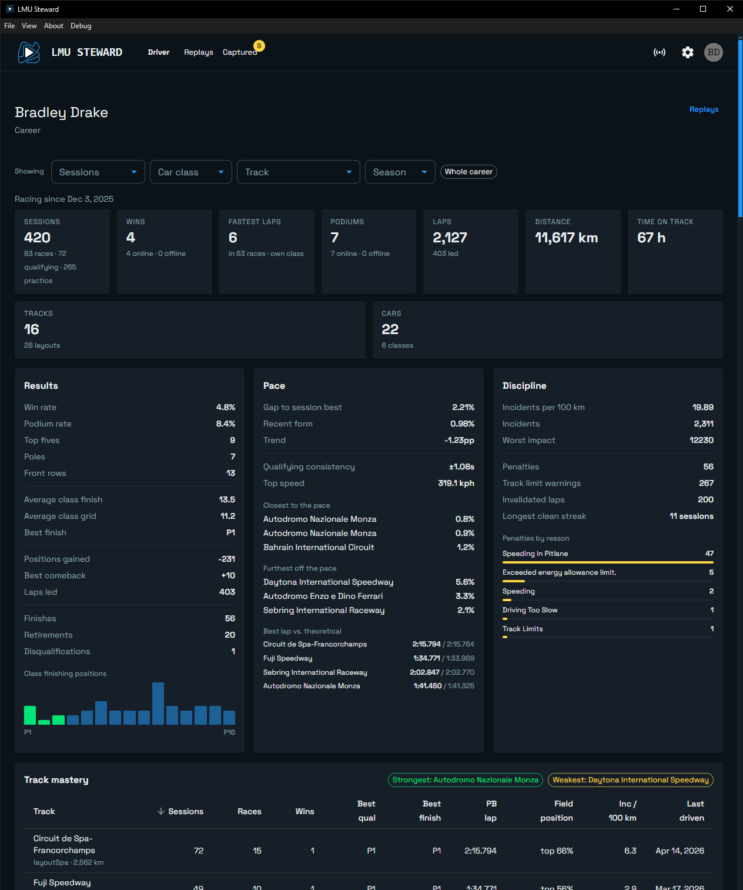

The Driver Dashboard is the app's home screen and a career-long view of your driving, built from every result log LMU has written. It answers "how am I actually doing?" rather than "what happened in that one race?".

Use the **Showing** filters at the top to narrow the whole page down by session type, car class, track, or season — or click **Whole career** to go back to everything.

**Headline stats:** Sessions, Wins, Fastest Laps, Podiums, Laps, Distance, Time on Track, Tracks, and Cars — each with a supporting breakdown (online vs. offline, races vs. qualifying vs. practice, layouts, classes).

**Results** — win rate, podium rate, top fives, poles, front rows, average class finish and grid, best finish, positions gained, best comeback, laps led, finishes, retirements, disqualifications, and a class finishing position histogram.

**Pace** — gap to session best, recent form and trend, qualifying consistency, top speed, the tracks you are closest to and furthest off the pace at, and your best lap versus your theoretical best per track.

**Discipline** — incidents per 100 km, total incidents, worst impact, penalties, track limit warnings, invalidated laps, your longest clean streak, and a breakdown of penalties by reason.

**Track mastery** — a sortable table of every track you have driven, with sessions, races, wins, best qualifying and finish, personal best lap, typical field position, incidents per 100 km, and when you last drove there. Your strongest and weakest circuits are called out above the table.

**Field & rivals**, **Cars & classes**, **Habits**, **Milestones**, and **Recent sessions** cards round out the page with who you race against most (and have the most contact with), what you drive, when you tend to run, and what you have recently achieved.

A **data health** control lets you rescan result logs — either reading only what is new, or re-reading every log on disk if a figure looks wrong.

---

## Session Replays

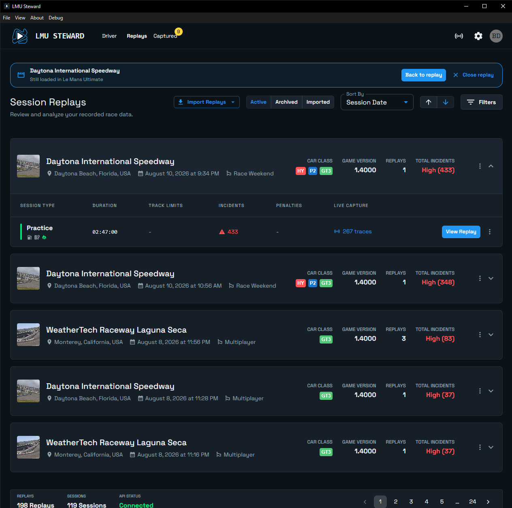

The **Replays** view is the starting point for all replay activity. It displays your recorded sessions grouped by track event — if a track weekend included Practice, Qualifying, and a Race, those sessions appear together under a single weekend card.

Each weekend card shows:
- **Track name and location**
- **Date and time** the weekend took place
- **Session context** (Race Weekend, Multiplayer)
- **Car classes** present, and the **game version** the replays were recorded on
- The number of **replays** in that weekend
- **Total incidents** with an **Incident Severity** badge (Low / Medium / High) based on average incidents per driver

Expanding a card reveals a row per session, each showing:
- Session type (Race, Qualifying, Practice)
- Duration
- Track limits, incidents, and penalties
- **Live Capture** — a link to the captured trace data for that session, if live capture recorded it
- A **View Replay** button that opens the full [Session Analysis](#session-analysis)
- A **⋮** menu for archiving and exporting

If a replay is currently loaded in LMU, a banner appears at the top of the page with **Back to replay** and **Close replay** — this banner survives an app restart, so you can always get back to (or out of) whatever LMU still has open.

### Sorting & Filtering

Use the controls at the top-right to organize your replay list:

**Sort By:**
- Session Date
- Track Name
- Total Incidents

**Sort Direction:** Ascending or Descending

**Filters** (click the filter icon):
- **Date Range** — narrow down to a specific time window
- **Track** — show only sessions at a particular circuit
- **Session Type** — Race, Qualifying, or Practice
- **Session Length** — Short (≤20 min), Medium (≤120 min), or Long
- **Car Class** — filter to a specific car class
- **Field Size** — Small (≤10), Medium (≤30), or Large grids
- **Class Format** — Single Class or Multi-Class
- **Incident Count** — filter by severity level

When filters are active, a badge appears on the filter button and the footer shows how many replays matched your criteria. If **Remember Filters and Sorting** is enabled in User Settings, your last-used filters and sort order are restored the next time you open the app.

### Active, Archived & Imported

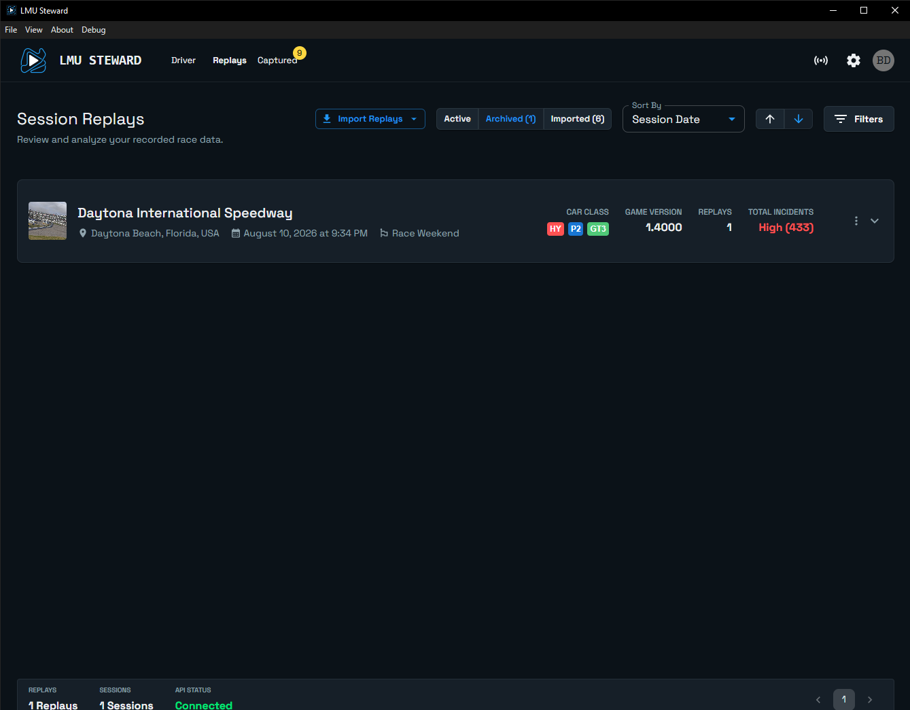

Three tabs split the library into separate lists, each with its own count:

| Tab | Contents |
|-----|----------|
| **Active** | Your normal working list — everything that has not been archived |
| **Archived** | Sessions you have reviewed and set aside. Nothing is deleted; they can be restored at any time |
| **Imported** | Replays brought in from another PC or another LMU Steward install |

### Archiving Sessions

Archiving takes a session or a whole weekend off your Active list without deleting anything.

Open the **⋮** menu on a session row for **Archive session**:

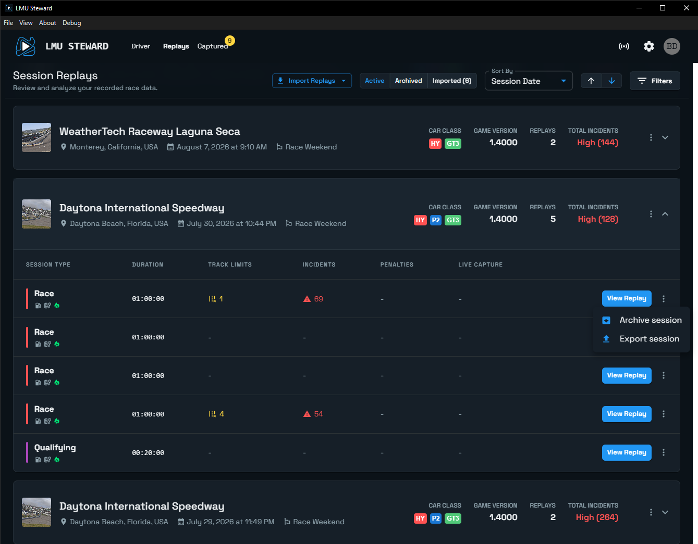

…or the **⋮** menu on the weekend header to archive every session in that weekend at once:

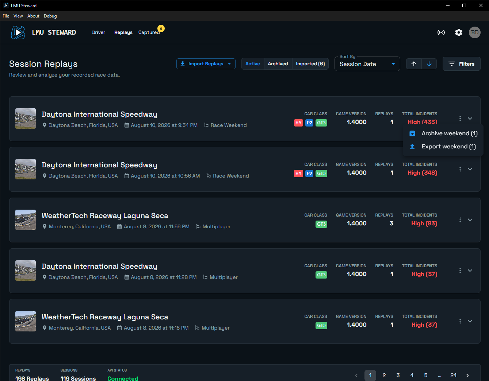

When you archive, you can attach an optional **note** — a reminder to yourself about why, for example "reviewed, no action needed". The note is shown on the replay in the Archived view and can be edited or removed later from that row's **⋮** menu, alongside **Restore session**.

### Exporting Replays

**Export session** and **Export weekend** sit in the same two **⋮** menus shown above — a session row for one session, the weekend header for the whole event. The count on the weekend entry tells you how many replays the hand-off will carry:

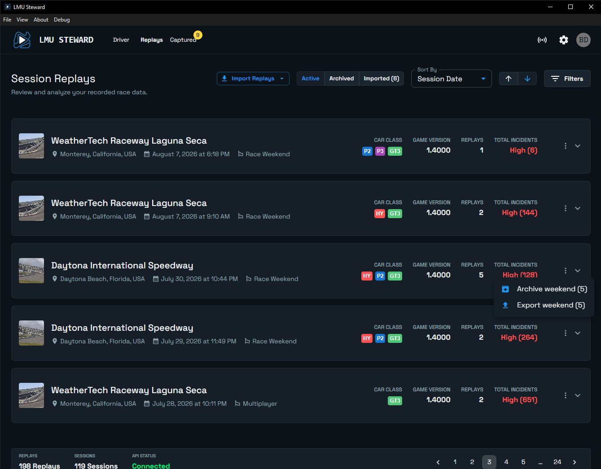

They package replays into a `.zip` hand-off that another LMU Steward install can import — the `.Vcr` files, their matching result logs, and the pairing between them.

That pairing is the point. LMU stores a replay's date on the file itself, which is lost the moment the file is copied to another PC; exporting from LMU Steward carries the correct session dates and log matches with it, so nothing has to be guessed at on the receiving side.

A few things to know:

- Export is only available when a replay has a **matched result log**. A `.Vcr` on its own is exactly the half-a-hand-off that makes an import guess.
- If the session has live capture data, you will be asked whether **captured telemetry** (per-driver throttle, brake, and steering traces) travels with the archive. This is opt-in — derived evidence like closing speeds and off-track flags always travels, but the raw traces are a recording of someone's driving and only go if you say so. The archive records which way you chose.
- Exporting replay *files* is deliberately separate from [exporting session **data**](#exporting-session-data) — one produces an archive for another LMU Steward install, the other a report for a league's spreadsheet.

### Importing Replays

Click **Import Replays** for three ways in:

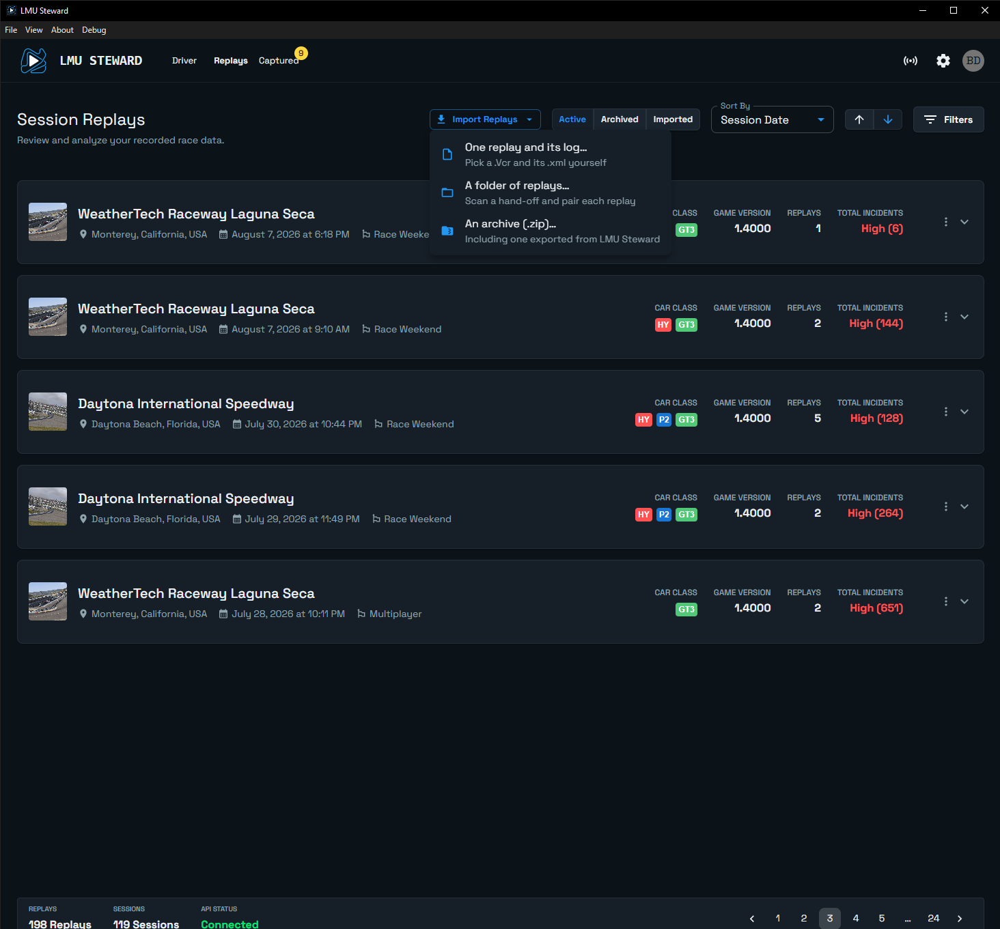

**One replay and its log…** — pick a `.Vcr` and its `.xml` result log yourself. Both files are required; the result log is what tells LMU Steward when the session actually happened. The dialog confirms how many drivers in the replay appear in the log so you can tell straight away whether you have paired the right two files, and you can attach an optional note about where the hand-off came from.

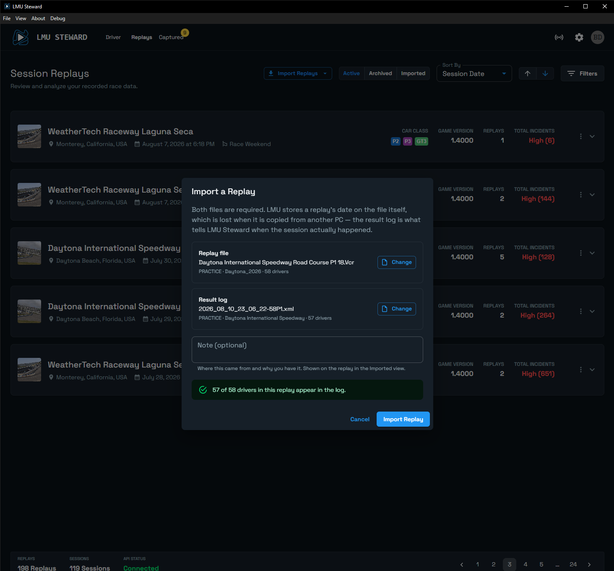

**A folder of replays…** — scan a folder and let LMU Steward pair each replay with its most likely log.

**An archive (.zip)…** — including one exported from LMU Steward. If the archive carries the exporter's own pairing, logs and session dates are taken as given rather than guessed at, and every replay is marked **From archive**. You can review the matches, override any result log from the dropdown, deselect anything you don't want, and apply a single note to the whole import.

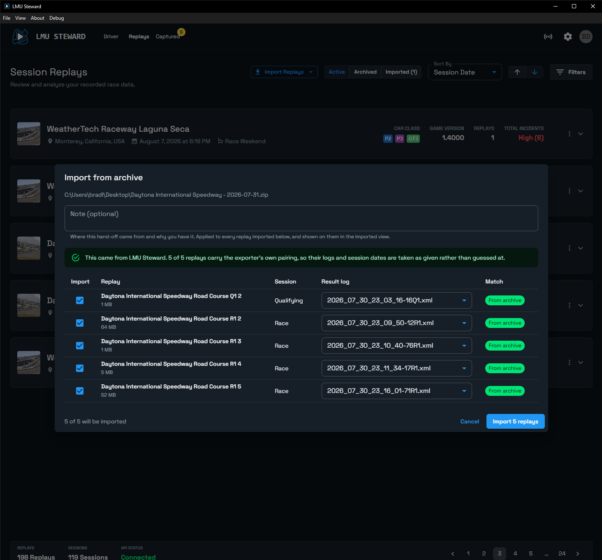

**Captured sessions come across too.** If a hand-off carries the capture that was exported with a replay, it is restored and linked to that replay automatically — its incidents, dossiers, and any telemetry the exporter chose to include appear in Session Analysis just as they would have on the original machine. All three import paths do this, and the dialog tells you what is arriving before you commit, including whether driver telemetry is part of it.

Imported replays land in the **Imported** tab, grouped into weekends and ready to analyze exactly like locally recorded ones:

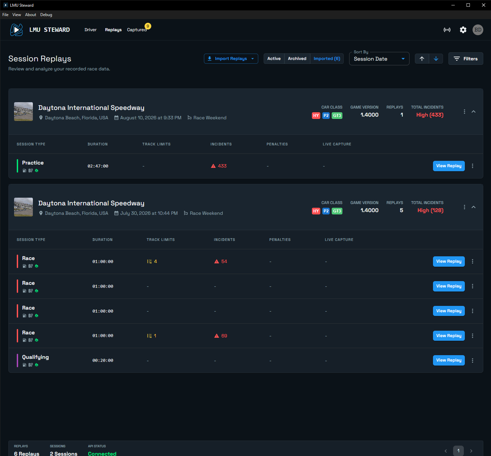

---

## Session Analysis

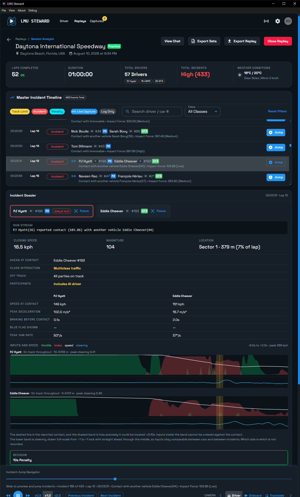

Click **View Replay** on any session to open the Session Analysis view. This is the core of LMU Steward — a comprehensive breakdown of everything that happened during that session.

The header shows the track name, session type (color-coded: Red for Race, Yellow for Qualifying, Green for Practice), date, location, and a breadcrumb trail so you always know where you are. Along the top are **View Chat**, **Export Data**, **Export Replay**, and **Close Replay**.

> **Note:** If a replay was captured after the live session was already in progress, a **Partial Replay Data** warning will appear. Incident timing in that case may be approximate.

### Session Summary

A row of info cards at the top gives you an at-a-glance overview:

| Card | Details |
|------|---------|
| **Laps Completed** | How many laps were completed and the percentage of race distance finished |
| **Duration** | Total session run time |
| **Total Drivers** | Number of drivers on the grid, broken down by car class |
| **Total Incidents** | Total incident count with a severity rating |
| **Weather Conditions** | Air and track temperature, sky conditions, and wind |

### Master Incident Timeline

A chronological, scrollable list of every event in the session. Each entry includes:
- Timestamp and lap number
- Event type: **Track Limit**, **Incident**, or **Penalty**
- Drivers involved, their car numbers, and their car classes
- A short description with the impact force and severity band
- A **Jump** button that instantly seeks LMU's replay camera to that exact moment

Above the list you can:
- Toggle **Track Limit**, **Incident**, and **Penalty** on and off
- Filter to **Live Capture** events (rows sourced from a linked capture, marked with a signal icon) or **Log Only** events
- **Search** by driver name or car number
- Filter by **Class**
- **Reset Filters** in one click

At the bottom of the page, the **Incident Jump Navigator** lets you slide through every incident in order, with **Previous Incident** / **Next Incident** buttons, playback speed controls (x0.5 / x1.0 / x2.0), and camera selection (Driver / Onboard / Trackside).

### Incident Dossier

When the session has a linked [live capture](#captured-sessions), selecting an incident opens a full dossier beneath the timeline — the same evidence a live steward sees, available after the fact.

It shows the parties involved (with a **Likely at fault** marker and a **Focus** button to put the replay camera on that car), the raw event as LMU reported it, and then the measurements:

- **Closing speed**, **magnitude**, and **location** (sector, distance into the lap, and percentage of lap)
- Who was **ahead at contact**, whether this was **multiclass traffic**, whether anyone was **off track**, and whether an **AI driver** was involved
- A side-by-side comparison of both drivers: speed at contact, peak deceleration, how long they were braking beforehand, whether a blue flag was shown, and peak yaw rate
- **Inputs and speed** traces for both cars over a window around the contact, showing throttle, brake, speed, and steering, with the reported contact marked and its timing precision shown as a shaded band

If you record a decision against the incident, it is shown here too.

### Exporting Session Data

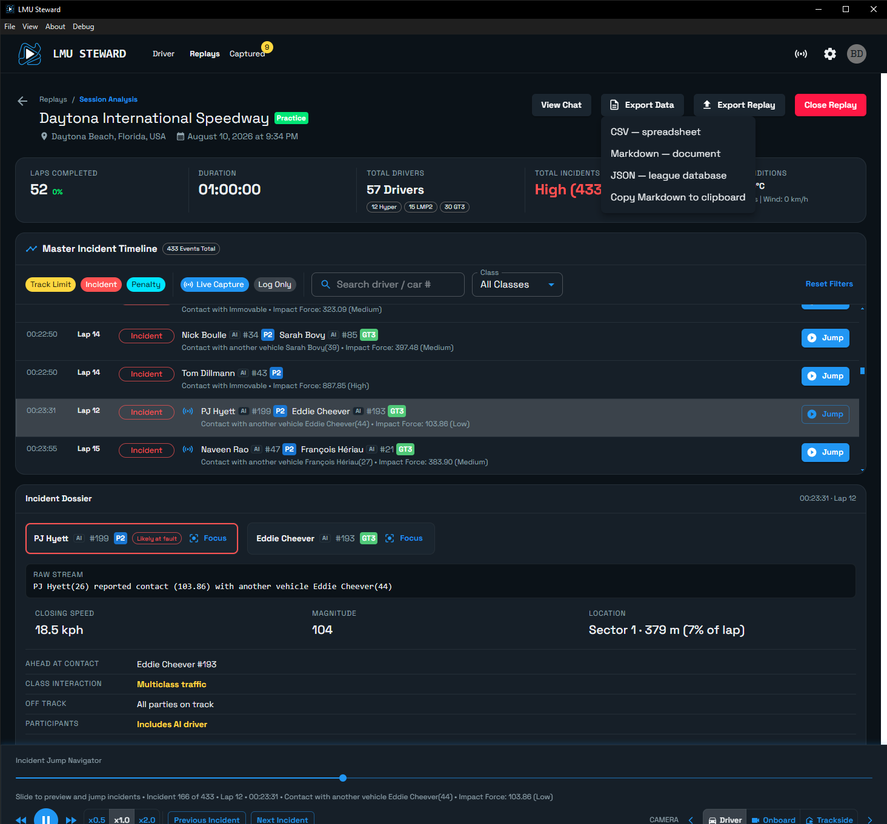

**Export Data** produces a report of the session record — results, incidents, and any steward decisions — in whichever shape you need:

| Format | Use it for |
|--------|-----------|
| **CSV** | A spreadsheet |
| **Markdown** | A document, or a post to a league forum |
| **JSON** | A league database or other tooling |
| **Copy Markdown to clipboard** | Pasting straight into Discord or a forum without touching a file |

Steward decisions carry the **steward name** they were recorded under into every format, so a call can be attributed on appeal.

### Incident Heatmap

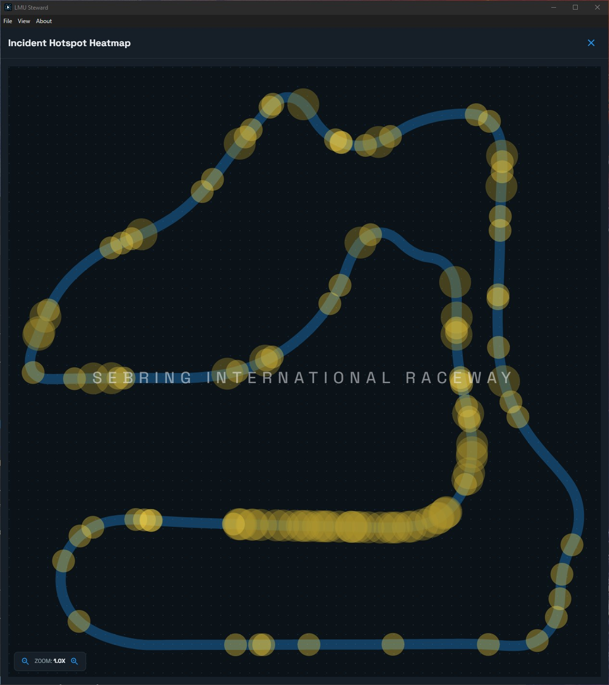

A visual overlay of the track map showing where incidents were concentrated during the session. Spots are color-coded by severity:
- **Minor** — lighter color
- **Serious** — medium color
- **Critical** — bright/intense color

Use this to quickly identify problem corners and high-risk sections of the circuit.

### Driver Standings

A full standings table showing the final classification for all drivers, including:
- **Finishing position**
- **Driver name** and car number (AI drivers carry an **AI** badge)
- **Car class** (with color-coded badge)
- **Fastest lap** time
- **Total incidents**
- **Risk Index** — a calculated score reflecting how frequently a driver was involved in incidents relative to the field

In multi-class sessions, use the class buttons above the table to filter the standings to a single class. Click any row to open the [Driver Analysis](#driver-analysis) view for that driver, or use the camera icon next to their name to put LMU's replay camera on their car.

### Session Chat Log

Click the **View Chat** button (in the top-right of the Session Analysis page) to open a side panel showing all in-game chat messages exchanged during the session, with driver names and message content.

### Quick View Mode

If you haven't yet loaded a replay into LMU's replay player, LMU Steward enters **Quick View** mode for that session. In this mode:
- The session summary, incident timeline, heatmap, and driver standings are all available
- Replay jump controls (Jump buttons, the Incident Jump Navigator) are disabled until you load the replay in LMU
- A **View Replay** button appears at the top — click it to trigger LMU to load the replay, which then unlocks full playback controls

---

## Driver Analysis

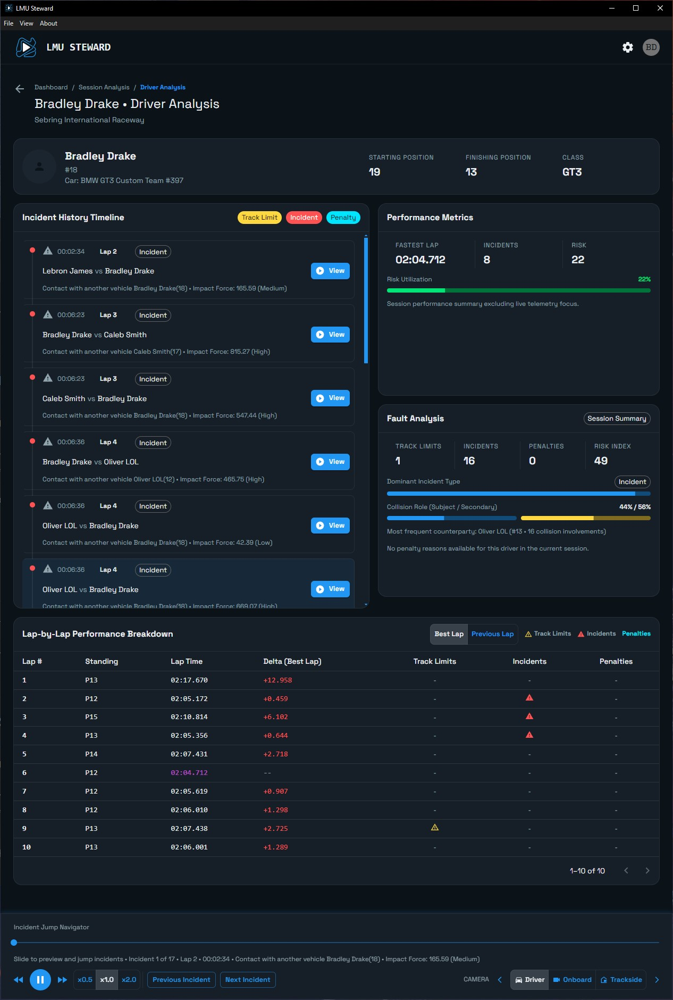

From the Driver Standings in Session Analysis, click any driver to open their individual Driver Analysis page. This view gives you a complete picture of one driver's session from every angle.

AI-controlled drivers are identified with an **AI** badge next to their name.

### Overview Card

A summary card at the top showing the driver's name, car number, car class, finishing position, and team name.

### Incident History Timeline

A detailed, filterable log of every incident this driver was involved in during the session. Each entry shows:
- Timestamp
- Incident type (Collision, Track Limit, Penalty)
- Other drivers involved (if a collision)
- Penalty reason (if a penalty)
- A **View Incident** button that jumps the LMU replay to that moment
- A **Jump To** bar for quick scrubbing through incidents chronologically

Use the toggle buttons above the list to show or hide specific incident types.

### Performance Metrics

A card showing three key stats for the driver:
- **Fastest Lap** — their personal best lap time during the session
- **Total Incidents** — number of incidents they appeared in
- **Risk Index** — how their incident rate compared to the rest of the field (higher = more incidents per lap/driver)

### Fault Analysis

When you click on an incident in the timeline, the Fault Analysis card updates to show a detailed breakdown of that specific event:
- **Fault Risk Index** — a score indicating likely fault attribution (subject vs. secondary party in a collision)
- **Dominant Incident Type** — the type of incident this driver was most involved in overall
- **Collision Statistics** — percentage breakdown of Subject (likely at fault) vs. Secondary (hit by another driver) across all their collisions
- **Top Counterparty** — the driver this driver collided with most often
- **Top Penalty Reason** — the most common reason they received a penalty

When no incident is selected, the card shows overall session-wide statistics for that driver.

### Lap-by-Lap Breakdown

A table showing performance data for each individual lap the driver completed, helping you spot where they lost time or where incidents occurred in context with their lap pace.

---

## Live Stewarding

> **Experimental.** Live stewarding requires **Experimental Features** and **Live Capture** to be enabled in [User Settings](#experimental-features). Live capture reads LMU's shared memory while the game runs.

While a session is running, LMU Steward records what happened as it happens — closing speeds, driver inputs, positions, blue flags — evidence a replay cannot rebuild afterwards. Click the green live indicator in the navigation bar to open the live session.

The session header shows the track, the current flag state, and how many incidents are unreviewed or flagged, followed by a strip of live session state: session type, time of day, time remaining, laps, air and track temperature, weather, field size, and the count of cars in each class. On a multi-segment weekend, a segment picker lets you move between Practice, Qualifying, and Race, with a dot showing whether each segment has a replay behind it.

A rail on the left switches between three sections.

### Overview

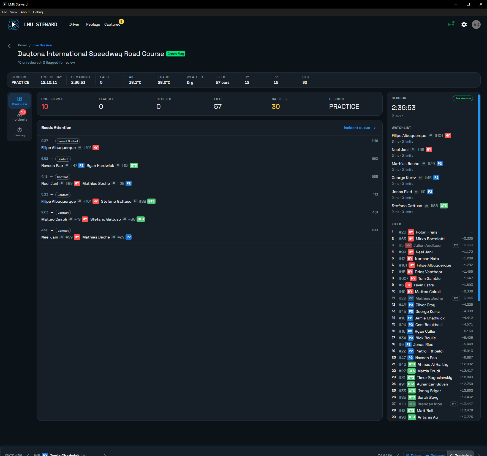

The at-a-glance view for someone who has to decide where to look next.

- **Unreviewed / Flagged / Decided** counts, **Field** size, **Battles** (cars within two seconds of each other), and the session type
- **Needs Attention** — the incidents that still need a call, ordered by magnitude, each showing the time, type (Contact, Loss of Control), the drivers involved, and the impact magnitude
- **Watchlist** — the drivers accumulating incidents and track limits, so repeat offenders surface without you hunting for them
- **Field** — the live running order with class badges, gaps, and pit/garage status

### Incidents

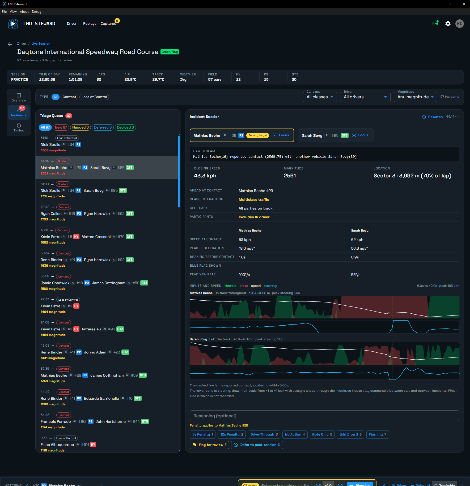

The adjudication view. On the left, a **Triage Queue** of every incident in the session, filterable by state (**All / New / Flagged / Deferred / Decided**), by type (**Contact / Loss of Control**), and by car class, driver, or magnitude.

Selecting one opens the same **Incident Dossier** described under [Session Analysis](#incident-dossier) — raw event, closing speed, magnitude, track location, ahead-at-contact, multiclass and off-track flags, the per-driver comparison, and the input traces for both cars. **Rewatch** replays the moment in LMU, and **Focus** puts the camera on a specific car.

At the bottom you record the call:

- An optional **Reasoning** note
- Your **penalty tariff** — 5s Penalty, 10s Penalty, Drive-Through, No Action, Note Only, and so on. This list is league-defined and fully editable in User Settings; whatever you write is exactly what the decision stores and what appears in exports. Each action has a number key shortcut.
- **Flag for review** to come back to it, or **Defer to post-session** to move it out of the live queue without losing it

Driver-scoped actions make it explicit which driver the penalty applies to, so a two-car incident can never end up with a penalty nobody can act on.

### Timing

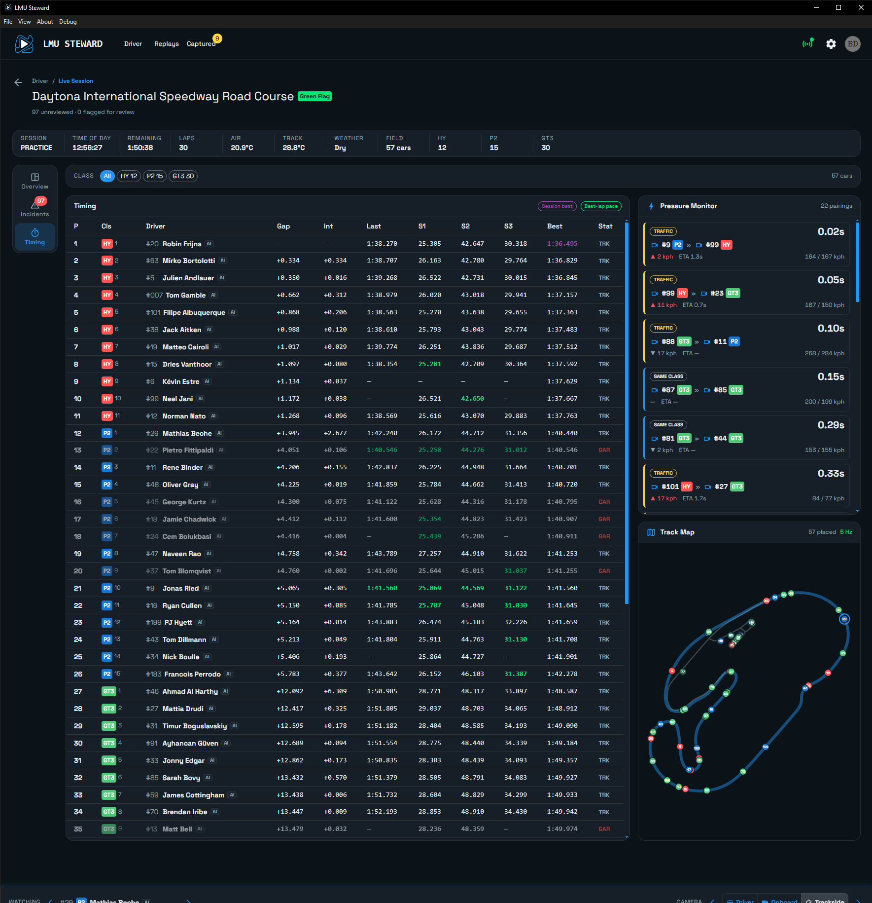

The timing screen, with a class filter across the top.

- **Timing table** — position, class position, driver, gap and interval, last lap, sector times, best lap, and track status per car. Toggle between highlighting **Session best** and **Best-lap pace**.
- **Pressure Monitor** — every pairing of cars closing on each other, labelled **Traffic** (different classes) or **Same class**, with the current gap, closing speed, estimated time to catch, and both cars' speeds. This is where you see a multiclass overtake coming before it becomes an incident.
- **Track Map** — a live map of the circuit with every car placed on it, updating at 5 Hz.

### Camera Controls

A camera bar is fixed to the bottom of every live section:

- **Watching** — which car the camera is on, with previous/next car controls and a pit/garage marker
- **Replay** — toggle into LMU's replay to rewatch something at **x0.5**, **x1.0**, or **x2.0**. Timing on screen stays live while you do; only the picture is rewound. **View live** returns you to the present.
- **Camera** — switch between **Driver**, **Onboard**, and **Trackside** groups, with previous/next angle within each

---

## Captured Sessions

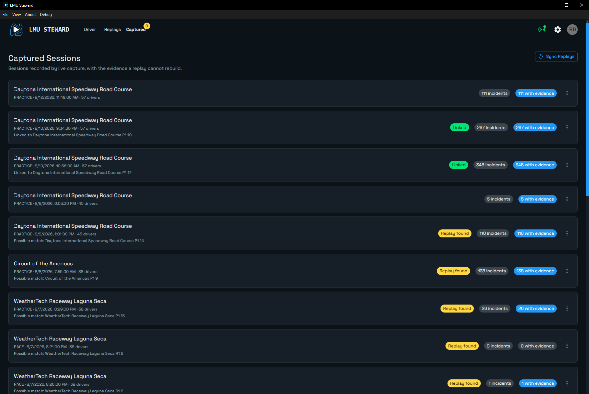

Everything live capture has recorded lives under **Captured**. Each row shows the track, session type, date, driver count, how many incidents were recorded, and how many of those carry evidence (telemetry traces).

The badge on the right tells you where each capture stands:

| Badge | Meaning |
|-------|---------|
| **Linked** | The capture is joined to a specific replay. Its incidents and traces now appear in that replay's Session Analysis. |
| **Replay found** | LMU Steward has spotted a likely replay for this capture but has not linked it — the suggested match is shown underneath |
| *(none)* | No replay match yet |

The count badge on the **Captured** nav item is how many captures are waiting on a decision. Use **Sync Replays** to rescan for new replays that may now match.

Each row's **⋮** menu offers **View Replay** (for a linked capture), **Link Replay** / **Change Replay**, and **Delete Session**.

### Linking a Capture to a Replay

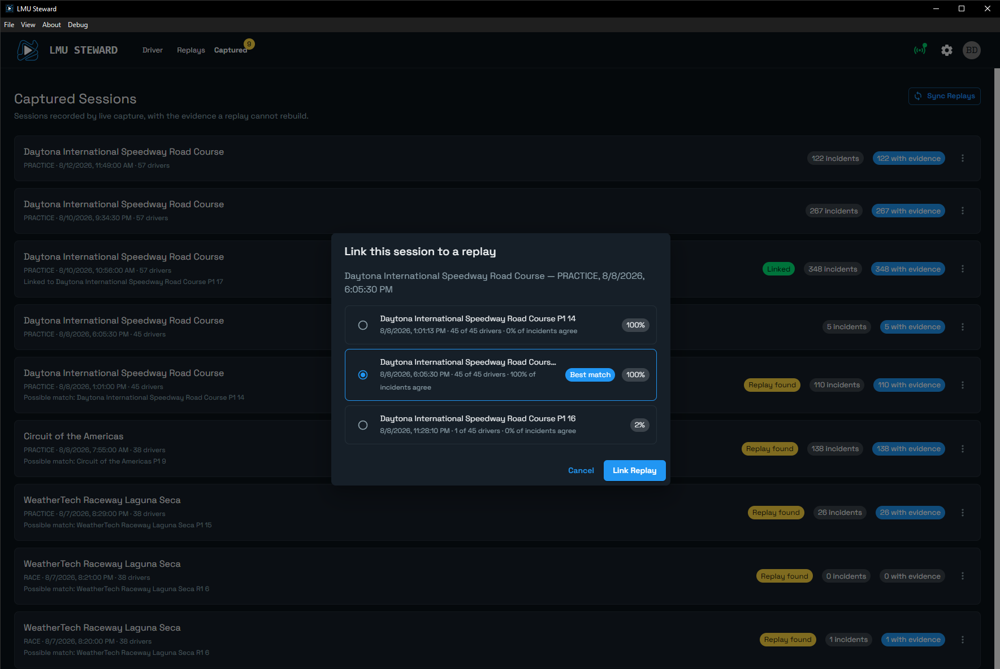

Choosing **Link Replay** shows the candidate replays with a confidence score for each, based on how many drivers and incidents agree between the capture and the replay's result log. The strongest candidate is marked **Best match**. Pick one and click **Link Replay** — the capture's incidents, dossiers, and telemetry are then available inside that replay's Session Analysis.

Captures are removed automatically once they pass the retention age set in User Settings. Steward decisions are never deleted.

---

## User Settings

Access settings by clicking the **gear icon** in the top-right corner of the navigation bar.

### Profile Information

Displays your LMU player profile pulled directly from LMU, including:
- **Name** and **Nickname**
- **Steam ID**
- **Nationality** (shown with flag)
- **Language**

Profile data is read-only — changes to your name or nationality must be made within LMU itself. Use **Sync Profile** to refresh this information from your current LMU account.

### System Configuration

These paths tell LMU Steward where to find LMU on your system:

| Setting | Description |
|---------|-------------|
| **LMU Executable Path** | The full path to your `LMU.exe` file. Used to launch LMU directly from the app. |
| **Path to LMU Replay Directory** | The folder where LMU stores your recorded replays. |
| **Close LMU when LMU Steward exits** | If LMU is running when you close LMU Steward, this option will also close LMU |

If your LMU is installed in a non-standard location, update these paths and click **Save** to apply the changes. **Return to Default** restores the detected paths.

### Replay Sync

Controls how LMU Steward keeps your replay library up to date:

| Setting | Description |
|---------|-------------|
| **Enable Automatic Sync** | Automatically syncs replay metadata in the background while the app is open |
| **Sync on App Launch** | Performs a sync every time you start LMU Steward |
| **Quick View Mode** | When enabled, session data is available to browse before loading a replay in LMU. Jump controls are locked until the replay is loaded. |
| **Sync Interval** | How often (in minutes) automatic sync checks for new replays |
| **Log Match Window** | How far apart a replay and a result log's timestamps can be and still be treated as the same session. LMU writes the two files at slightly different times depending on machine performance and disk behavior, so change this only if replay information does not match log information. |
| **Sync Now** | Manually trigger an immediate sync |

The last sync timestamp is displayed so you always know how current your data is.

### Session Replays Behavior

| Setting | Description |
|---------|-------------|
| **Remember Filters and Sorting** | Restores the filters and sort order you last used on the session replay list when LMU Steward starts. When disabled, the list opens unfiltered and sorted by newest session. |

### Experimental Features

Features that are still being tested. They may change, behave incorrectly on some setups, or be removed in a later release — everything already in LMU Steward keeps working either way. The section lists what is currently experimental so you can see exactly what you would be turning on.

| Setting | Description |
|---------|-------------|
| **Enable Experimental Features** | The master switch. Required for everything below. |
| **Live Capture** | Reads LMU's shared memory while the game is running so live stewarding can capture incidents as they happen. This briefly takes a lock that wheel LED and motion software also use — leave it off if you see those misbehave. Has its own switch on top of the experimental gate, so turning experimental features on does not start reading shared memory on its own. |
| **Keep Captured Sessions** | How long captured sessions and their telemetry are kept — 7, 30, or 90 days, or never delete. A contact window is roughly 100 KB and a long race records hundreds of them, so an install left alone would grow without bound. Steward decisions are never deleted. Shortening this window destroys data, so it asks for confirmation. |
| **Steward Name** | Recorded on every decision you make from now on, and carried into CSV, Markdown, and JSON exports so a call can be attributed on appeal. Decisions already made keep the name they were made under. |
| **Penalty tariff** | The list of actions a steward can record against an incident. Leagues run drive-throughs, stop-gos, time penalties, grid drops, licence points, reprimands, warnings and DSQs in whatever combination their rulebook says, so the list is yours to define. Each action is marked as applying to a single driver or to the incident as a whole. **Revert to default** restores the shipped list. |

### Local Storage

| Setting | Description |
|---------|-------------|
| **Clear Local Storage** | Manually wipe all locally stored app data (requires confirmation) |

> Settings with toggles (on/off switches) save automatically. Settings that require text input (file paths) require you to click **Save** to apply.

---

## Tips & Troubleshooting

**The app says "LMU Disconnected"**
- This means LMU Steward cannot reach the LMU backend. Make sure LMU is running, or check that your paths in User Settings are correct.
- You can still access User Settings while disconnected.

**No replays appear under Replays**
- Go to User Settings and confirm the **Path to LMU Replay Directory** points to the correct folder.
- Click **Sync Now** to force a fresh scan.
- If filters are active, try clearing them — a filter badge on the filter button indicates active filters.
- Check you are on the **Active** tab and not **Archived** or **Imported**.

**Jump buttons are greyed out**
- The replay isn't loaded in LMU yet. Click **View Replay** at the top of the Session Analysis page to load it, then the jump controls will become available.

**Replay data shows a "Partial Replay" warning**
- This happens when recording started after the session was already underway. Incident timestamps may be slightly off from where they appear in playback — this is expected.

**Profile shows "Unknown Steward"**
- LMU may not be running, or your player profile hasn't been synced yet. Launch LMU, then return to User Settings and click **Sync Profile**.

**The live session indicator never lights up**
- Live capture needs both **Experimental Features** and **Live Capture** enabled in User Settings, and LMU must be running with a session loaded.

**My wheel LEDs or motion rig started misbehaving**
- Live capture briefly takes a machine-wide lock that this software also uses. Turn **Live Capture** off in User Settings; everything else in the app keeps working.

**Export session / Export weekend is greyed out**
- Export requires a replay to have a matched result log. Without one, the receiving install would have to guess which race the replay belongs to. Check the **Log Match Window** setting if you expect a log to have matched.

**A captured session never links to its replay**
- Use **Sync Replays** on the Captured page to rescan, then link it manually from the row's **⋮** menu. The dialog shows a confidence score for each candidate.

---

## License

MIT
